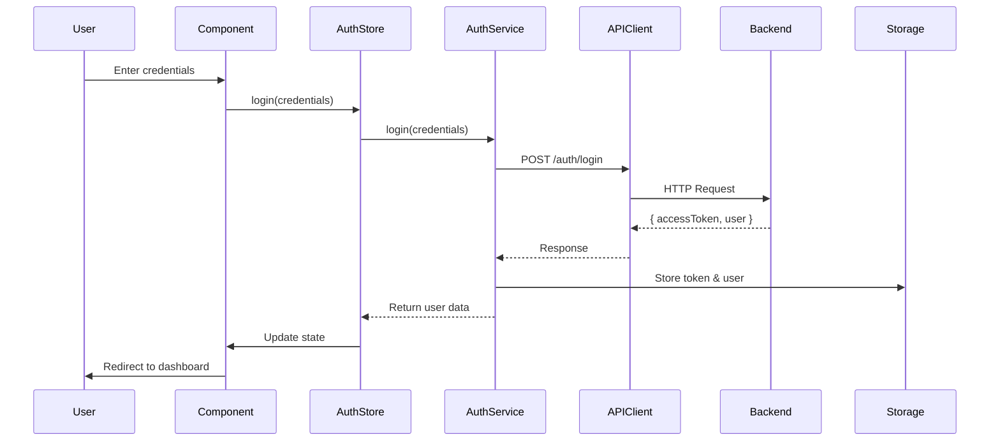

# React Application Architecture Guide

## 📁 Project Structure

```
src/
├── components/          # Reusable UI components
│   ├── ui/             # shadcn/ui components
│   └── ProtectedRoute.tsx
├── config/             # Configuration files
│   └── api.config.ts   # API endpoints & settings
├── hooks/              # Custom React hooks
│   └── useAuth.ts      # Authentication hook
├── pages/              # Page components (routes)
│   ├── auth/
│   │   ├── Login.tsx
│   │   └── Register.tsx
│   ├── Dashboard.tsx
│   ├── RFQList.tsx
│   └── Index.tsx
├── services/           # API service layer (✅ React Native compatible)
│   ├── api.client.ts   # Axios client with interceptors
│   ├── auth.service.ts
│   ├── dashboard.service.ts
│   ├── rfq.service.ts
│   └── quote.service.ts
├── store/              # Zustand state management (✅ React Native compatible)
│   └── auth.store.ts
├── types/              # TypeScript types (✅ React Native compatible)
│   └── api.types.ts
└── utils/              # Utility functions (✅ React Native compatible)
    └── storage.util.ts
```

## 🏗️ Architecture Patterns

### 1. Service Layer Pattern

All API calls are centralized in service files. Each service handles a specific domain.

**Example: auth.service.ts**
```typescript
import { apiClient } from './api.client';
import { LoginRequest, AuthResponse } from '@/types/api.types';

export const authService = {
  login: async (credentials: LoginRequest): Promise<AuthResponse> => {
    const response = await apiClient.post('/auth/login', credentials);
    // Store tokens
    return response.data;
  },
  // ... other methods
};
```

**Benefits:**
- Single source of truth for API calls
- Easy to mock for testing
- Reusable across platforms (Web & React Native)
- Type-safe with TypeScript

### 2. State Management (Zustand)

Lightweight state management for global state.

**Example: auth.store.ts**
```typescript
import { create } from 'zustand';

interface AuthStore {
  user: User | null;
  login: (credentials: LoginRequest) => Promise<void>;
  logout: () => Promise<void>;
}

export const useAuthStore = create<AuthStore>((set) => ({
  user: null,
  login: async (credentials) => {
    const response = await authService.login(credentials);
    set({ user: response.user });
  },
  logout: async () => {
    await authService.logout();
    set({ user: null });
  },
}));
```

**Why Zustand over Redux?**
- Less boilerplate
- Better TypeScript support
- Smaller bundle size
- Simpler learning curve

### 3. API Client with Interceptors

Centralized Axios instance handles:
- Authentication headers
- Token refresh
- Error handling
- Request/response transformation

**Key Features:**
```typescript
// Request interceptor - Add auth token
config.headers.Authorization = `Bearer ${token}`;

// Response interceptor - Handle 401, refresh token
if (error.response?.status === 401) {
  // Refresh token logic
}
```

### 4. Storage Abstraction

Abstract storage operations for cross-platform compatibility:

**Web:** localStorage
```typescript
export const storage = {
  getItem: <T>(key: string): T | null => {
    return JSON.parse(localStorage.getItem(key));
  },
};
```

**React Native:** AsyncStorage
```typescript
export const storage = {
  getItem: async <T>(key: string): Promise<T | null> => {
    return JSON.parse(await AsyncStorage.getItem(key));
  },
};
```

## 🔐 Authentication Flow



## 📱 React Native Migration Guide

### Files That Are 100% Reusable
✅ All files in `src/types/`
✅ All files in `src/config/`
✅ All files in `src/services/` (with minor axios changes if needed)
✅ All Zustand stores in `src/store/`
✅ Business logic in `src/utils/`

### Files That Need Adaptation

#### storage.util.ts
**Web:**
```typescript
import { storage } from '@/utils/storage.util';
```

**React Native:**
```typescript
// Replace localStorage with AsyncStorage
import AsyncStorage from '@react-native-async-storage/async-storage';
```

#### Navigation
**Web:** react-router-dom
```typescript
import { useNavigate } from 'react-router-dom';
const navigate = useNavigate();
navigate('/dashboard');
```

**React Native:** @react-navigation/native
```typescript
import { useNavigation } from '@react-navigation/native';
const navigation = useNavigation();
navigation.navigate('Dashboard');
```

#### UI Components
**Web:** HTML + Tailwind CSS
```tsx
<div className="flex items-center">
  <Button>Click me</Button>
</div>
```

**React Native:** React Native components
```tsx
<View style={styles.container}>
  <TouchableOpacity>
    <Text>Click me</Text>
  </TouchableOpacity>
</View>
```

## 🛠️ Best Practices & Patterns

### 1. Form Handling with React Hook Form

```typescript
import { useForm } from 'react-hook-form';
import { zodResolver } from '@hookform/resolvers/zod';
import { z } from 'zod';

const loginSchema = z.object({
  email: z.string().email('Invalid email'),
  password: z.string().min(6, 'Min 6 characters'),
});

const { register, handleSubmit, formState: { errors } } = useForm({
  resolver: zodResolver(loginSchema),
});
```

### 2. Error Handling

```typescript
// In services
try {
  const response = await apiClient.get('/endpoint');
  return response.data;
} catch (error: any) {
  // Error is already formatted by interceptor
  throw error;
}

// In components
try {
  await authStore.login(credentials);
  toast.success('Login successful');
} catch (error: any) {
  toast.error(error.message || 'Login failed');
}
```

### 3. Loading States

```typescript
const [isLoading, setIsLoading] = useState(false);

const handleAction = async () => {
  setIsLoading(true);
  try {
    await someAsyncOperation();
  } finally {
    setIsLoading(false);
  }
};
```

### 4. Protected Routes

```typescript
const ProtectedRoute = ({ children }) => {
  const { isAuthenticated } = useAuth();
  
  if (!isAuthenticated) {
    return <Navigate to="/auth/login" replace />;
  }
  
  return <>{children}</>;
};
```

## 🧪 Testing Strategy

### Unit Tests (Jest)
```typescript
// services/auth.service.test.ts
import { authService } from './auth.service';
import { apiClient } from './api.client';

jest.mock('./api.client');

describe('authService', () => {
  it('should login successfully', async () => {
    const mockResponse = { accessToken: 'token', user: {...} };
    (apiClient.post as jest.Mock).mockResolvedValue({ data: mockResponse });
    
    const result = await authService.login({ email: '...', password: '...' });
    expect(result).toEqual(mockResponse);
  });
});
```

### Component Tests (React Testing Library)
```typescript
import { render, screen, fireEvent } from '@testing-library/react';
import Login from './Login';

test('renders login form', () => {
  render(<Login />);
  expect(screen.getByLabelText(/email/i)).toBeInTheDocument();
  expect(screen.getByLabelText(/password/i)).toBeInTheDocument();
});
```

## 📦 Recommended Packages

### Core Dependencies
- ✅ **axios** - HTTP client
- ✅ **zustand** - State management
- ✅ **react-router-dom** - Routing (Web)
- ✅ **@tanstack/react-query** - Server state management
- ✅ **react-hook-form** - Form handling
- ✅ **zod** - Schema validation
- ✅ **tailwindcss** - Styling (Web)

### Development Tools
- **ESLint** - Code linting
- **Prettier** - Code formatting
- **TypeScript** - Type safety
- **Jest** - Testing framework
- **React Testing Library** - Component testing

### Optional Enhancements
- **Storybook** - Component documentation
- **MSW** - API mocking for tests
- **date-fns** - Date utilities
- **sonner** - Toast notifications (already installed)

## 🚀 Performance Optimization

### Code Splitting
```typescript
// Lazy load pages
const Dashboard = lazy(() => import('./pages/Dashboard'));

<Suspense fallback={<Loading />}>
  <Dashboard />
</Suspense>
```

### React Query for Caching
```typescript
import { useQuery } from '@tanstack/react-query';

const { data, isLoading } = useQuery({
  queryKey: ['dashboard'],
  queryFn: dashboardService.getDashboard,
  staleTime: 5 * 60 * 1000, // 5 minutes
});
```

### Memoization
```typescript
const expensiveCalculation = useMemo(() => {
  return data.reduce(...);
}, [data]);

const handleClick = useCallback(() => {
  // Handler logic
}, [dependencies]);
```

## 📝 Environment Variables

Create `.env` file:
```bash
# API Configuration
VITE_API_URL=https://api.production.com

# Feature Flags
VITE_ENABLE_ANALYTICS=true
```

Access in code:
```typescript
const apiUrl = import.meta.env.VITE_API_URL;
```

## 🎯 Quick Start Commands

```bash
# Install dependencies
npm install

# Development
npm run dev

# Build for production
npm run build

# Run tests
npm test

# Lint code
npm run lint

# Format code
npm run format
```

## 📚 Additional Resources

- [React Docs](https://react.dev)
- [TypeScript Handbook](https://www.typescriptlang.org/docs/)
- [Zustand Docs](https://github.com/pmndrs/zustand)
- [React Query Docs](https://tanstack.com/query/latest)
- [Axios Docs](https://axios-http.com/docs/

---

**Note:** This architecture is designed to be scalable, maintainable, and easily portable to React Native. The separation of concerns ensures that business logic remains platform-agnostic.
